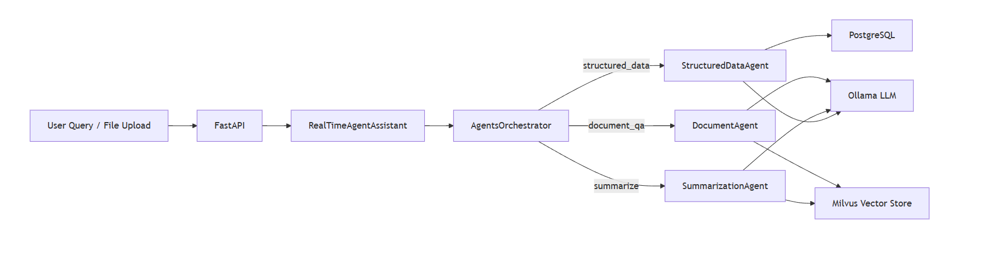

# Agentic RAG System

An **Agentic Retrieval-Augmented Generation (RAG)** system that lets you query both **unstructured documents** (PDF, DOCX, PPTX, TXT, MD) and **structured data** (CSV, XLSX → PostgreSQL) using natural language. Built with FastAPI, Milvus, PostgreSQL, and a local Ollama LLM — no cloud AI required.

---

## Features

* 📄 **Document Q&A** — Ask questions grounded in uploaded document content
* 🗄️ **SQL Q&A** — Query structured data (CSV/Excel) using plain English
* ✂️ **Summarization** — Generate concise summaries of documents
* 🔄 **Auto-ingestion** — Drop files into the watch folder for automatic indexing
* 🖥️ **Streamlit UI** — Chat interface with file upload and database controls
* 🔒 **SQL Safety** — Only `SELECT` and `WITH` queries are executed

---

## System Architecture



### Routing Logic

1. **IntentRouterAgent** classifies queries as `structured_data`, `document_qa`, or `summarize`
2. A **score-based SQL heuristic** runs in parallel for sanity checks
3. Queries are routed to the correct agent, with a fallback to `DocumentAgent` if needed

---

## Project Structure

```
agentic_rag2/
├── main.py                  # FastAPI app
├── streamlit-app.py         # Streamlit chat UI
├── agents.py                # Document/SQL/Summarization agents
├── agents_pipeline.py       # Orchestrator + metadata caching
├── intent_router_agent.py   # LLM-based intent classifier
├── rag_pipeline.py          # ANN + keyword re-ranking
├── ingestion_pipeline.py    # File load → clean → chunk → embed → insert
├── milvus_client.py         # Milvus vector DB connection
├── postgres_client.py       # PostgreSQL connection
├── sql_agent.py             # NL → SQL generation & execution
├── text_preprocess.py       # Cleaning & chunking utilities
├── ollama_client.py         # Ollama LLM client
├── models.py                # Pydantic models
├── settings.py              # Config (.env)
├── exceptions.py            # Custom exceptions
├── logger.py                # Logging setup
├── uploaded_docs/           # Auto-ingested files
├── data/                    # Sample files
├── docs/                    # Markdown documentation
├── images/                  # Diagrams and screenshots
└── test/                    # Test files & notebooks
```

---

## Setup

### Prerequisites

* Python 3.10+
* [Ollama](https://ollama.ai/) running locally
* Milvus (can use Docker)
* PostgreSQL (can use Docker)

### Installation

1. Clone the repository:

```bash
git clone https://github.com/AnuragIndora/AgenticRAG-Application.git
cd AgenticRAG-Application
```

2. Install dependencies:

```bash
pip install -r requirements.txt
```

3. Pull Ollama models:

```bash
ollama pull gemma3n         # Chat/generation
ollama pull embeddinggemma  # Embeddings
```

4. Configure `.env`:

```env
API_HOST=0.0.0.0
API_PORT=8000

MILVUS_HOST=localhost
MILVUS_PORT=19530
MILVUS_COLLECTION_NAME=agentic_rag_chunks
EMBEDDING_DIM=768

PG_HOST=localhost
PG_PORT=5432
PG_DATABASE=agentic_rag
PG_USER=raguser
PG_PASSWORD=ragpass

OLLAMA_BASE_URL=http://127.0.0.1:11434
LLM_MODEL=gemma3n:latest
EMBEDDING_MODEL=embeddinggemma:latest
REQUEST_TIMEOUT_SECONDS=90

CHUNK_SIZE_TOKENS=1000
CHUNK_OVERLAP_TOKENS=150
RETRIEVAL_TOP_K=8
```

5. Start FastAPI server:

```bash
uvicorn main:app --host 0.0.0.0 --port 8000 --reload
```

6. (Optional) Start Streamlit UI:

```bash
streamlit run streamlit-app.py
```

---

## API Reference

### `POST /query`

Send a natural language question:

```json
{
  "query": "What were the total sales last quarter?",
  "task_type": null
}
```

Response:

```json
{
  "answer": "...",
  "intent": "structured_data",
  "confidence_score": 0.9,
  "sources": [],
  "reasoning_steps": ["Generated SQL query", "Executed SQL", "Formatted result"],
  "sql_query": "SELECT ..."
}
```

---

### `POST /upload`

* **PDF, DOCX, PPTX, TXT, MD** → stored in Milvus
* **CSV, XLSX** → loaded into PostgreSQL (table name = filename without extension)

```bash
curl -X POST http://localhost:8000/upload -F "file=@report.pdf"
```

---

### `GET /status`

```json
{ "ingested_files": ["report.pdf", "sales_data.csv"] }
```

---

### `DELETE /reset`

```bash
# Reset Milvus only
curl -X DELETE http://localhost:8000/reset

# Reset Milvus + PostgreSQL tables
curl -X DELETE "http://localhost:8000/reset?delete_sql=true"
```

---

## Using Docker for Milvus & PostgreSQL (Optional)

### 1️⃣ Run Containers Directly with Docker

```bash
# Run Milvus container
docker run -d \
  --name milvus \
  -p 19530:19530 \
  milvusdb/milvus:v2.3.0

# Run PostgreSQL container
docker run -d \
  --name pg \
  -e POSTGRES_USER=raguser \
  -e POSTGRES_PASSWORD=ragpass \
  -e POSTGRES_DB=agentic_rag \
  -p 5432:5432 \
  postgres:15
```

> ✅ This will start Milvus and PostgreSQL as separate containers with the specified ports and credentials.

---

### 2️⃣ Using `docker-compose`

If you have a `docker-compose.milvus.yml` file, you can start everything with a single command:

```bash
docker-compose -f docker-compose.milvus.yml up -d
```

* `-d` runs containers in detached mode (in the background).
* Make sure your `docker-compose.milvus.yml` defines services for **Milvus** and **PostgreSQL**.

---

### Pro Tips

1. To see running containers:

```bash
docker ps
```

2. To view logs for Milvus:

```bash
docker logs -f milvus
```

3. To stop containers:

```bash
docker-compose -f docker-compose.milvus.yml down
# OR
docker stop milvus pg
docker rm milvus pg
```

---

## Limitations

* SQL agent only supports `SELECT` and `WITH` queries
* Large files may consume significant memory during embedding
* No authentication or multi-tenancy
* Summarization quality depends on retrieval
* Milvus `VARCHAR` metadata fields have max-length constraints

---