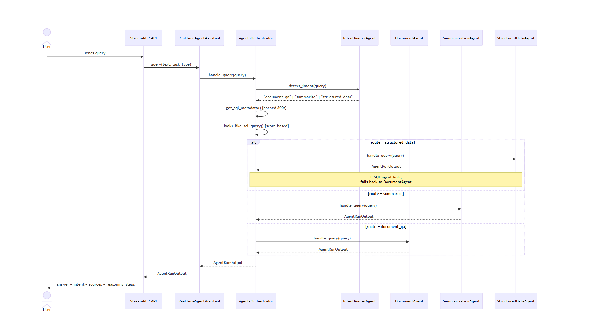
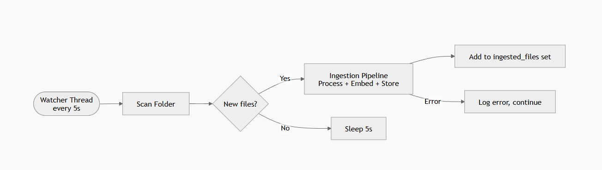

# Agentic Workflow Design

## Overview

The system uses a **multi-agent orchestration pattern** where a central orchestrator (`AgentsOrchestrator`) receives every query, classifies it, and delegates to a specialized agent. Agents are stateless — each one handles exactly one query and returns a structured `AgentRunOutput`.

---

## Agent Roster

| Agent | Class | Handles |
|---|---|---|
| Document Q&A | `DocumentAgent` | Questions over uploaded documents |
| Summarization | `SummarizationAgent` | "Summarize this document" type requests |
| Structured Data | `StructuredDataAgent` | Questions answered by running SQL on PostgreSQL |

---

## Full Query Lifecycle



---

## Intent Detection — Two-Pass System

Intent routing uses two independent signals combined to reach a final routing decision:

### Pass 1: LLM Classification (`IntentRouterAgent`)

The LLM receives the query and returns one of three labels: `structured_data`, `document_qa`, or `summarize`. If the LLM call fails (timeout, empty response), a keyword-based fallback kicks in:

```
SQL keywords detected (select, from, where, join)  →  "structured_data"
Otherwise                                            →  "document_qa"
```

### Pass 2: SQL Heuristic Scoring (`looks_like_sql_query`)

Runs in parallel with Pass 1. Scores the query against real table and column names pulled from Postgres:

| Signal | Score |
|---|---|
| SQL keyword match | +3 |
| Real table name in query | +2 |
| Real column name in query | +1 |
| Both `select` + `from` present | +5 |
| **Trigger threshold** | **≥ 3** |

### Final Decision Logic

```
if LLM says "structured_data"      → route to SQL agent
else if SQL heuristic score ≥ 3    → route to SQL agent (override)
else if LLM says "summarize"       → route to Summarization agent
else                               → route to Document agent
```

---

## Per-Agent Workflow

### DocumentAgent

```
retrieve top-5 chunks via RAGPipeline
  ↓
build context string (chunk texts joined by \n\n)
  ↓
prompt: "Use ONLY the provided context. If not found, say I don't know."
  ↓
OllamaClient.generate → answer
  ↓
AgentRunOutput(intent="document_qa", confidence=0.85, sources=chunks)
```

### SummarizationAgent

```
retrieve top-5 chunks via RAGPipeline
  ↓
combine all chunk texts
  ↓
prompt: "Summarize the following content concisely"
  ↓
OllamaClient.generate → summary
  ↓
AgentRunOutput(intent="summarize", confidence=0.80, sources=chunks)
```

### StructuredDataAgent

```
SQLAgent.generate_sql(query)
  ↓ LLM prompt → SQL string
  ↓ strip markdown fences
  ↓ reject if not SELECT/WITH
  ↓ validate table names exist in DB
PostgresClient.execute_query(sql) → raw rows
  ↓
OllamaClient.generate → plain-English explanation
  ↓
AgentRunOutput(intent="structured_data", confidence=0.90, sql_query=sql)
```

---

## Auto-Ingestion Agent (Background)

`RealTimeAgentAssistant` runs a **daemon thread** that polls `uploaded_docs/` every 5 seconds:




> The watcher thread is a **daemon** — it dies automatically when the main process exits, so no explicit cleanup is needed.

---

## Fallback Strategy

If `StructuredDataAgent` raises any exception (bad SQL, table not found, Postgres error), the orchestrator **silently falls back** to `DocumentAgent` and logs a warning. The user always gets an answer.
